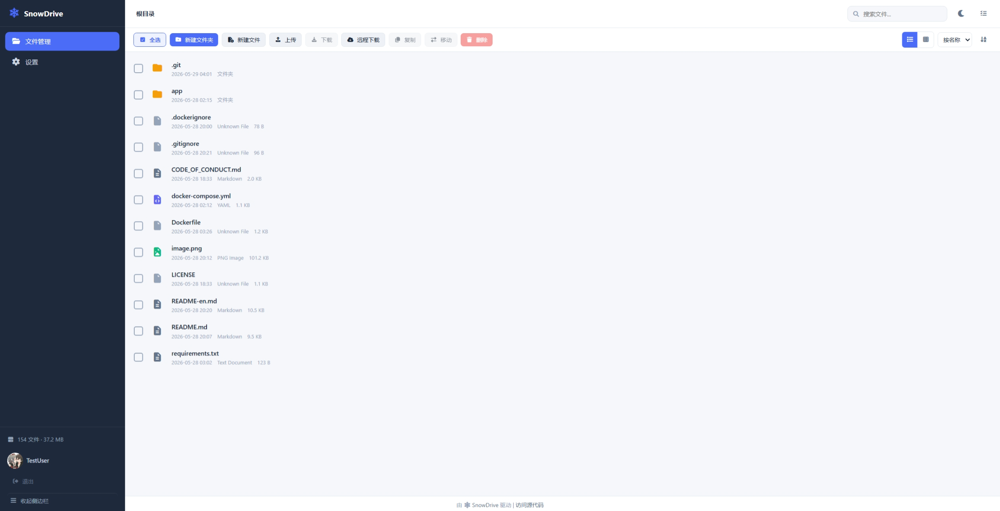

# ❄️ SnowDrive

简体中文 | [English](README-en.md)

**安全远程文件访问系统** —— 基于 Python/Flask 的轻量级 NAS 方案，Docker 一键部署。


  
  
  
  


## 🌐 在线体验

- 🏠 项目主页：[snowdrive.lclty.cn](https://snowdrive.lclty.cn)
- 🎮 在线演示：[snowdrive.lclty.cn/demo](https://snowdrive.lclty.cn/demo)

## ✨ 功能特性

- 🔐 **安全认证** —— 用户名 + 密码 + 强制双因素认证（2FA）
  - TOTP 动态验证码（兼容 Microsoft Authenticator、Google Authenticator 等）
  - WebAuthn/Passkey 支持（指纹、面部识别、Windows Hello、YubiKey 等）
- 📁 **完整文件管理** —— 浏览、上传、下载、新建文件/文件夹、复制、移动、重命名、删除
- 🌐 **远程下载** —— 粘贴 URL 即可将远程文件下载到服务器，后台任务实时追踪进度
- 📦 **批量操作** —— 多选文件批量下载（自动 ZIP 打包）、拖拽上传
- 🎨 **精美 UI** —— 响应式设计，深浅色主题切换，移动端适配
- 🔒 **全本地化** —— CSS/JS/FontAwesome 全部本地引用，零外部 CDN 依赖
- 👤 **单用户模式** —— 全局唯一账户，首次访问引导注册，适合个人/家庭使用
- 💾 **持久化存储** —— 数据库与头像文件存储在容器外 Volume，升级/重建容器不丢数据



## 🚀 快速开始

### 从 Docker Hub 拉取（推荐）

```bash
docker pull lclty/snowdrive:latest

docker run -d \
  --name snowdrive \
  -p 8080:8080 \
  -v /your/data/path:/data \
  -v /your/userdata/path:/userdata \
  -e SNOWDRIVE_SECRET_KEY=your-random-secret-string \
  lclty/snowdrive:latest
```

 **💡 给中国大陆用户**：如果 Docker Hub 拉取缓慢或失败，可以尝试通过代理拉取，或从 [Releases](https://github.com/lclty/snowdrive/releases) 页面下载镜像文件后离线导入：

 ```bash
 cd /path/to/images
 docker load -i snowdrive.tar

 docker run -d \
  --name snowdrive \
  -p 8080:8080 \
  -v /your/data/path:/data \
  -v /your/userdata/path:/userdata \
  -e SNOWDRIVE_SECRET_KEY=your-random-secret-string \
  snowdrive:latest
 ```

## 🔨 本地构建

使用 Docker 构建的优势：
- **环境隔离** —— 不污染宿主机 Python 环境，无需手动安装依赖
- **一键部署** —— 所有依赖打包在镜像中，跨平台一致运行
- **便捷管理** —— 启停、升级、回滚均通过 Docker 命令完成

没有安装 Docker？请前往 [Docker 官网](https://www.docker.com/) 下载 Docker Desktop（Windows/macOS）或安装 Docker Engine（Linux）。

### 1. Docker Compose 部署（推荐）

```bash
# 克隆仓库
git clone https://github.com/lclty/snowdrive.git
cd snowdrive

# 编辑 docker-compose.yml，修改挂载路径和密钥
# 将 volumes 中的 ./data 改为你要共享的实际目录
# 将 SNOWDRIVE_SECRET_KEY 改为随机字符串

docker compose up -d --build
```

> 如果构建时需要代理拉取基础镜像，取消 `docker-compose.yml` 中 `args` 部分的注释并填入代理地址。

### 2. Docker 命令部署

```bash
git clone https://github.com/lclty/snowdrive.git
cd snowdrive

# 构建镜像
docker build -t snowdrive .

# 运行容器
docker run -d \
  --name snowdrive \
  -p 8080:8080 \
  -v /your/local/data:/data \
  -v $(pwd)/userdata:/userdata \
  -e SNOWDRIVE_SECRET_KEY=your-random-secret \
  snowdrive
```


## 🌐 如何访问

### 本地访问

打开浏览器访问 **http://localhost:8080**

首次访问将引导你创建管理员账户并设置 2FA（TOTP 和/或 WebAuthn/Passkey）。

> ⚠️ **注意**：由于浏览器安全策略限制，WebAuthn/Passkey 仅在以下场景可用：
> - `http://localhost`（本地开发）
> - `https://`（生产环境 HTTPS）
>
> 使用纯 HTTP（非 localhost）访问时仅能使用 TOTP 验证方式。

### 公网访问（Nginx 反向代理）

以下为 Nginx HTTPS 反向代理配置模板：

```nginx
server {
    listen 80;
    server_name your-domain.com; #替换为你的域名
    return 302 https://$host$request_uri;
}

server {
    # 请先通过 'nginx -v' 查看 NGINX 版本
    ## 如果你使用的 NGINX 版本 < 1.25.1:
    listen 443 ssl http2;
    listen [::]:443 ssl http2;
    ## 如果你使用的NGINX版本 >= 1.25.1:
    #listen 443 ssl;
    #listen [::]:443 ssl;
    #http2 on;

    # 如果你想启用 HTTP/3 ，请取消注释下面这几行
    # 请在启用前确保你的 NGINX 构建支持 HTTP/3
    #listen 443 quic;
    #listen [::]:443 quic;
    #add_header Alt-Svc 'h3=":443"; ma=86400';

    server_name your-domain.com; #替换为你的域名

    # SSL 证书（请替换为你的证书路径）
    # 可参考 https://zhuanlan.zhihu.com/p/347064501 使用 acme.sh 申请 SSL 证书
    ssl_certificate     /path/to/your/fullchain.pem;
    ssl_certificate_key /path/to/your/privkey.pem;

    # 安全配置
    ssl_protocols TLSv1.2 TLSv1.3;
    ssl_ciphers HIGH:!aNULL:!MD5;

    client_max_body_size 0;   # 不限制上传大小

    location / {
        proxy_pass http://127.0.0.1:8080;
        proxy_set_header Host $host;
        proxy_set_header X-Real-IP $remote_addr;
        proxy_set_header X-Forwarded-For $proxy_add_x_forwarded_for;
        proxy_set_header X-Forwarded-Proto $scheme;
    }
}

```

修改配置文件后，请重启你的 NGINX 或重载运行 NGINX 的 Docker 容器。


## 📋 2FA 重置

如果丢失了 2FA 设备（换电脑、换手机、密钥丢失等），可通过 CLI 强制重置：

```bash
docker exec -it snowdrive reset-2fa <username> <password>
```

验证密码后，该用户的 2FA 将被清除，下次登录时会强制重新设置。


## 🔧 环境变量

| 变量 | 说明 | 默认值 |
|------|------|--------|
| `SNOWDRIVE_SECRET_KEY` | JWT 签名密钥（**生产环境务必修改**） | 随机生成 |
| `SNOWDRIVE_SESSION_DAYS` | 登录会话有效期（天） | `7` |
| `TZ` | 容器时区 | `Asia/Shanghai` |
| `HTTP_PROXY` | 容器内 HTTP 代理（远程下载功能出境用） | — |
| `HTTPS_PROXY` | 容器内 HTTPS 代理（远程下载功能出境用） | — |


## 🛡️ 安全说明

- **务必修改 `SNOWDRIVE_SECRET_KEY`** 为足够长的随机字符串（可用 `openssl rand -hex 32` 生成）
- **强烈建议使用 HTTPS**，配合 Nginx/Caddy 反向代理，否则密码明文传输且 WebAuthn 不可用
- 密码使用 **bcrypt** 哈希存储，不可逆
- 会话采用 **httpOnly Secure Cookie + JWT** 双重验证，JWT 令牌经 SHA-256 哈希后存库
- 所有文件操作均有 **路径遍历防护**（`safe_join_path` 限制在 `/data` 目录内）
- 敏感操作（修改密码、删除 2FA 方式）均需二次验证当前密码


## 🏗️ 技术栈

| 层级 | 技术 |
|------|------|
| 后端框架 | Python 3.12 + Flask 3.1 |
| 数据库 | SQLite（存储在 `/userdata/snowdrive.db`） |
| 认证 | bcrypt + PyJWT + Cookie |
| 2FA | pyotp (TOTP) + webauthn (WebAuthn/Passkey) |
| 前端 | Jinja2 模板 + 原生 JavaScript + CSS3 |
| 图标 | FontAwesome 6（本地离线） |
| 容器化 | Docker + Docker Compose |


## 📁 项目结构

```
SnowDrive/
├── app/
│   ├── main.py              # Flask 应用入口 & 蓝图注册
│   ├── config.py            # 配置类（路径、密钥、参数）
│   ├── auth.py              # 认证蓝图（注册/登录/2FA 设置与验证）
│   ├── files.py             # 文件管理蓝图（浏览/上传/下载/远程下载）
│   ├── settings.py           # 用户设置蓝图（头像/密码/2FA 管理）
│   ├── models.py            # 数据库模型 & CRUD 操作
│   ├── utils.py             # 工具函数（哈希/JWT/路径安全/后台下载）
│   ├── cli.py               # 命令行工具（reset-2fa）
│   ├── static/              # 静态资源（CSS/JS/FontAwesome）
│   └── templates/           # Jinja2 页面模板
├── docker-compose.yml       # Docker Compose 编排文件
├── Dockerfile               # Docker 镜像构建文件
├── requirements.txt         # Python 依赖
└── README.md
```


## ⭐ Star History

如果 SnowDrive 对你有帮助，欢迎点亮 Star ⭐ 支持一下，每一颗星都是我们持续更新的动力！

[](https://star-history.com/#lclty/snowdrive&Date)

## 🤝 参与贡献

我们非常欢迎任何形式的贡献，无论是代码、文档还是创意点子：

- 🐛 **报告 Bug**：通过 [GitHub Issues](https://github.com/lclty/snowdrive/issues) 提交问题
- 🚀 **提交代码**：Fork 仓库 → 创建特性分支 → 修改并提交 → 发起 Pull Request
- 📖 **完善文档**：修正错别字、补充说明、优化排版，帮助新手更快上手

> 提交 PR 前，请确保代码风格与项目一致，并优先在新分支上开发。

## 💖 支持项目

如果你觉得 SnowDrive 不错，不妨：

- 点亮仓库右上角的 ⭐ **Star**，让更多人看到它
- 将它推荐给身边有 NAS / 个人云需求的朋友

你的每一次点赞和分享，都是对我们最大的鼓励 ❤️


## 📄 License

本项目基于 MIT 协议开源，详见 [LICENSE](LICENSE) 文件。

